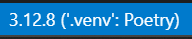

# Contributing to cwms-python

For the Contributors/Maintainers of cwms-python

cwms-python uses:

- [Poetry](https://python-poetry.org/docs/) for package and dependency management.
- [pytest](https://pypi.org/project/pytest/) for testing of python functions as they are made.
- [requests-mock](https://pypi.org/project/requests-mock/) for simulating CDA to provide network-less tests, effectively mocking the requests to CDA.  
- [black](https://black.readthedocs.io/en/stable/) for code formatting.
- [isort](https://pycqa.github.io/isort/index.html) - for python imports sorting.


## Getting Started

In order to set up the development environment you will need to have [poetry][poetry] installed on your computer.

1. To install poetry (with python 3.8+) run:  
    `python -m pip install poetry` or `pip install poetry`

2. You can then install all of the project dependencies by running the following command.

    ```sh
    poetry install
    ```

    1. In VSCode you will be prompted to "activate venv", click accept on this to switch to this new poetry venv.  
    2. *NOTE: If you do not have your python `Scripts` directory in your path this will fail.  
    `Scripts` is located in your python install directory, add this to your PATH.*  

    This will create a virtual environment in `.venv/` in the project's root directory.

### Check Your Changes

**Before submitting** a pull request (PR), you should verify that all the tests are passing and that the types are correct.

```sh
poetry run pytest -v tests/

poetry run mypy --strict cwms/
```

Run poetry against a single file with:  
*\*From the root of the project\**

```sh
poetry run pytest tests/turbines/turbines_test.py
```

### Local CDA Testing and Development

To test and develop with a local CDA instance, follow these steps:

For application code and manual local development, `cwms.api.init_session()`
now supports either `api_key=` or `token=` authentication. When both are
passed, bearer token auth takes precedence.

1. **Install Docker**  
    Download and install Docker from the [official website](https://www.docker.com/get-started/).

2. **Start and Verify CDA Services**  
    From the project root, run:
    ```sh
    docker compose up -d
    ```
    This will start the required services: Oracle database instance, CWMS API, Keycloak Auth, and Traefik proxy.  
    Additionally, there is a one-time service that runs and then shuts down; this service connects to the database instance to set initial conditions and users.  
    If you want to update the initial data in the database, you can do so by editing the `compose_files/sql/users.sql` file.

    Ensure all these services are running by checking their status:
    ```sh
    docker compose ps
    ```
    All containers should have a `State` of `Up` before proceeding.

    #### Service Ports and Access

    By default, the local CDA instance will be accessible at [http://localhost:8082](http://localhost:8082), and the Oracle database will be available on port `1526`. When developing or running tests, ensure your application or test configuration points to these ports.

    > **Note:** If you are running other instances of CDA or Oracle on your machine, they may use different ports. Always verify which ports are in use and update your configuration files accordingly to avoid conflicts.

    #### Selecting CDA and Database Versions

    Local Compose defaults to CDA `develop-nightly` and database/schema-installer
    `latest-dev`. Override the image references in a local, uncommitted `.env`
    file when reproducing a particular environment, for example:

    ```dotenv
    CWMS_DATA_API_IMAGE=ghcr.io/usace/cwms-data-api:2026.05.12-i
    CWMS_DATABASE_IMAGE=ghcr.io/hydrologicengineeringcenter/cwms-database/cwms/database-ready-ora-23.5:26.02.17
    CWMS_SCHEMA_INSTALLER_IMAGE=ghcr.io/hydrologicengineeringcenter/cwms-database/cwms/schema_installer:26.02.17
    ```

    Keep the database and schema-installer tags together. Use a separate Compose
    project for each database version, so the test data and containers are isolated:

    ```sh
    docker compose -p cwms-python-release pull
    docker compose -p cwms-python-release up -d --wait --wait-timeout 2400
    ```

    Use the same project name for subsequent `ps`, `logs`, and `down` commands.
    Stop the previous stack before starting another one using the same host ports.

    The integration workflow in `.github/workflows/CDA-testing.yml` tests every
    combination of three CDA images and three database versions on Python 3.9
    and latest stable (`3.x`) in exhaustive runs (18 jobs):

    | Lane | CDA tag | Database and schema-installer tag |
    | --- | --- | --- |
    | latest | `develop-nightly` | `latest-dev` |
    | production | `2026.05.12-i` | `26.02.17` |
    | test | `2026.08.31-testd` | `26.07.16-RC02` |

    These release pins are maintained in the workflow; update them when the
    target environments change. CDA and database are independent matrix axes,
    so testing includes mixed versions, not only the three same-lane pairs.
    Each job starts a disposable local stack, waits for backend health, and
    uses the hashed test keys seeded by `compose_files/sql/users.sql`. CI never
    runs these destructive integration tests against the deployed environments.

3. **Run Tests Against CDA**  
    Once the services are running, execute the tests:
    ```sh
    poetry run pytest tests/
    ```
    This will run all tests, including those that require a CDA connection.

    #### Running CDA Tests Against Other Instances

    Developers can also run the tests in the `tests/cda/` package against other CDA instances by providing the `--api_key` and `--api_root` command line arguments. For example:

    ```sh
    poetry run pytest tests/cda/ --api_root=http://localhost:8082/cwms-data/
    ```

    At the moment, the CDA pytest options are still keyed to `--api_key`; the
    new `token=` support is available through `cwms.api.init_session()` in
    library code.

    > **Warning:** The tests in the `tests/cda/` package are destructive and may cause irreversible deletion of data from the targeted CDA instance. Use caution and avoid running these tests against production or important environments.

### Code Style

In order for a pull request to be accepted, python code must be formatted using [black][black] and [isort][isort]. YAML files should also be formatted using either Prettier or the provided pre-commit hook. Developer are encouraged to integrate these tools into their workflow. Pre-commit hooks can be installed to automatically validate any code changes, and reformat if necessary.

```sh
poetry run pre-commit install
```

It is also possible to run the pre-commit hooks without committing if you simply want to format the code.

```sh
# Format staged files without committing
poetry run pre-commit run

# Format all source files
poetry run pre-commit run --all-files
```

## Releases

Releases use [Release Please](https://github.com/googleapis/release-please), following
the workflow used by [cwms-cli](https://github.com/HydrologicEngineeringCenter/cwms-cli).

### PR titles and version bumps

Use a Conventional Commit title for changes that should be released:

| Version bump | Required commit format | When to use it | Example from `1.2.3` |
| --- | --- | --- | --- |
| **Major** | `!` after the type or scope, such as `feat!: ...` or `fix(parser)!: ...`, or a `BREAKING CHANGE: description` footer in the merged commit | Breaking changes that require callers to change their code | `2.0.0` |
| **Minor** | `feat: description` or `feat(scope): description`, without a breaking-change marker | New functionality that preserves compatibility | `1.3.0` |
| **Patch** | `fix: description` or `fix(scope): description`, without a breaking-change marker | Compatible bug fixes | `1.2.4` |

**A breaking change must be explicitly marked; `feat:` alone produces a minor
bump, not a major bump.** Describe the incompatibility and migration steps in the
PR, and preserve the `!` or `BREAKING CHANGE:` footer in the final merged commit.

`perf:`, `revert:`, `deps:`, and `docs:` also trigger patch releases with this
repository's Python release strategy when no breaking-change marker is present.
Ordinary `test:`, `ci:`, `build:`, `chore:`, `refactor:`, and `style:` commits do
not trigger a release on their own. Accepting a title prefix does not make it a
release trigger.

Release Please considers the commits since the last release. The highest required
bump wins: **major over minor over patch**, rather than one bump per PR.

The PR-title workflow adds an advisory comment when a title lacks the
`<type>: description` format, regardless of which files change. Any type is
accepted, including `test:`, `ci:`, and `chore:`, as are optional scopes and
breaking-change markers. Titles must include a space after the colon and a
nonempty description. It updates the same comment and removes it when the title
is corrected. This format check does not determine whether a release is needed.

Squash merging uses the PR title as the commit subject by default. Check the final
subject before merging; Release Please reads commits on `main`, not PR titles
directly. With other merge methods, preserve Conventional Commit messages in the
merged commits.

### CI coverage

Unit tests and strict type checks run on Python **3.9** and **latest stable**
(`3.x`) for PRs targeting any branch and pushes to `main`. Formatting and CodeQL
also run on PRs and main. Feature-branch pushes do not start duplicate checks;
new PR commits cancel superseded runs. Draft and documentation-only PRs use the
same straightforward checks as other PRs.

The **CDA integration (PR production, weekly exhaustive)** workflow runs on every
PR. Ordinary PRs run two integration jobs: production CDA with the production
database/schema on Python **3.9** and **latest stable** (`3.x`). These jobs use
disposable local containers with production version pins, not deployed production
services. New PR commits cancel superseded integration runs.

The full **18-job matrix** runs weekly on **Monday at 08:17 UTC**, on manual
dispatch, and on Release Please PRs (branches beginning with `release-please--`).
It covers two Python versions, three CDA versions, and three schema versions,
including mixed CDA/schema combinations.

**Before merging a Release Please PR, all 18 integration jobs must pass for its
current revision.** If the bot-created PR has no checks, close and reopen it as
described below, or manually run the full matrix against its head branch. You can
also run the full matrix for any other PR when broader coverage is useful:

```sh
gh workflow run CDA-testing.yml --ref <branch>
```

Replace `<branch>` with the branch name on GitHub. Alternatively, use **Actions >
CDA integration (PR production, weekly exhaustive) > Run workflow** and select the
branch. Starting the workflow does not mean the tests passed; check the completed
run in Actions before approving.
Inspect failed combinations and backend logs, reproduce using the Compose
overrides above, and fix the cause rather than dropping failing combinations.

Release publishing still tests the exact tag on latest stable Python, verifies
the package version, and builds before publishing. CodeQL retains its weekly run.
Repository administrators should require the two unit-test checks, the two
production CDA integration checks, formatting, and CodeQL (plus existing external
requirements). The other 16 CDA combinations do not run on ordinary PRs and
should not be required globally. Maintainers must verify the full release matrix
before merging a release PR; these workflow changes do not modify repository
merge rules or enforce a separate release-only merge gate.

### Release flow

1. Merge reviewed changes into `main`.
2. The **Release Please** workflow opens or updates a release PR containing the
   proposed `pyproject.toml` version, `CHANGELOG.md`, and
   `.release-please-manifest.json`.
3. Review the proposed version and release notes, verify the required checks and
   all 18 CDA integration jobs pass for the current revision, and merge the release
   PR when ready.
4. The same workflow creates the `vX.Y.Z` tag and GitHub release, checks out that
   exact tag, tests and builds the distribution, publishes to PyPI, signs the
   distributions, and attaches the files to the GitHub release.

Do not manually bump versions, create release tags, or draft GitHub releases for
normal releases. The Python release strategy updates Poetry's version; existing
runtime version lookups continue to read package metadata. The manifest starts
at `1.0.8` and `bootstrap-sha` points to `v1.0.8`, so the first changelog
starts after the last existing release. Historical release notes remain on
[GitHub](https://github.com/HydrologicEngineeringCenter/cwms-python/releases).

The old automatic TestPyPI deployment is retired. Default-branch merges prepare
a release PR; publishing occurs only after that release PR is merged. To try an
unreleased checkout locally, run `poetry install` or install a locally built wheel.

### Maintainer setup and recovery

- In **Settings > Actions > General**, allow GitHub Actions to create pull
  requests. Keep the normal review and branch-protection requirements.
- Publishing keeps the existing `.github/workflows/pypi-deploy.yml` filename and
  `release` environment to preserve the PyPI trusted-publisher identity. Verify
  the publisher for `cwms-python` names owner `HydrologicEngineeringCenter`,
  repository `cwms-python`, workflow `pypi-deploy.yml`, and environment `release`.
  Keep any environment approvals required by the repository. If the environment
  restricts deployment branches, allow the default branch: the workflow runs
  there and explicitly checks out the release tag for the build.
- The workflow uses `GITHUB_TOKEN`. GitHub does not start ordinary PR workflows
  for PRs created by that token. If a release PR is missing checks, a maintainer
  can close and reopen it to trigger the PR workflows. Wait for required checks
  before merging; do not bypass them. The title reminder also becomes active
  only after its workflow is merged into the default branch.
- A failed publication can leave a GitHub release without a PyPI package or
  assets. Use **Re-run failed jobs** on the original run after fixing the cause;
  a fresh dispatch may find the release already created and skip publishing.
  If PyPI already accepted the package, rerun only the failed signing/upload step
  through a reviewed recovery workflow; PyPI versions cannot be overwritten.
- Release preparation is restricted to the upstream repository. Forks can run
  tests without trying to publish the upstream package.
