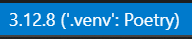

# CWMSpy

CWMS REST API for Data Retrieval

## Requirements.

Python 3.9+

## Installation & Usage

### pip install

```sh
pip install cwms-python
```

Then import the package:

```python
import cwms
```

## Getting Started

```python
import cwms
from datetime import datetime, timedelta

end = datetime.now()
begin = end - timedelta(days = 10)
data = cwms.get_timeseries(ts_id='Some.Fully.Qualified.Ts.Id',office_id='OFFICE1' , begin = begin, end = end)

#a cwms data object will be provided this object containes both the JSON as well
#as the values converted into a dataframe

#display the dataframe

df = data.df
print(df)
```

```
     date-time 	value 	quality-code
0 	2024-04-23 08:15:00 	86.57 	3
1 	2024-04-23 08:30:00 	86.57 	3
2 	2024-04-23 08:45:00 	86.58 	3
3 	2024-04-23 09:00:00 	86.58 	3
4 	2024-04-23 09:15:00 	86.58 	3
5 	2024-04-23 09:30:00 	86.58 	3
6 	2024-04-23 09:45:00 	86.59 	3
7 	2024-04-23 10:00:00 	86.58 	3
```

```python
#display JSON
json = data.JSON
print(json)
```

```
{'name': 'Some.Fully.Qualified.Ts.Id',
 'office-id': 'MVP',
 'units': 'ft',
 'values': [['2024-04-23T08:15:00', 86.57, 3],
  ['2024-04-23T08:30:00', 86.57, 3],
  ['2024-04-23T08:45:00', 86.57999999999997, 3],
  ['2024-04-23T09:00:00', 86.57999999999997, 3],
  ['2024-04-23T09:15:00', 86.57999999999997, 3],
  ['2024-04-23T09:30:00', 86.57999999999997, 3],
  ['2024-04-23T09:45:00', 86.59, 3],
  ['2024-04-23T10:00:00', 86.57999999999997, 3]],
 'version-date': None}
```

## TimeSeries Profile API Compatibility Warning

Currently, the TimeSeries Profile API may not be fully supported
until a new version of cwms-data-access is released with the updated 
endpoint implementation.

## Developer Documentation
For the Contributors/Maintainers of cwms-python

cwms-python uses:

- [Poetry](https://python-poetry.org/) for package and dependency management.
- [pytest](https://pypi.org/project/pytest/) for testing of python functions as they are made.
- [requests-mock](https://pypi.org/project/requests-mock/) for simulating CDA to provide network-less tests, effectively mocking the requests to CDA.

### Setting up Dev Environment

1. To install poetry (with python 3.8+) run:  
    `python -m pip install poetry` or `pip install poetry`
2. To install dependencies with poetry run:  
    `poetry install`  
    1. In VSCode you will be prompted to "activate venv", click accept on this to switch to this new poetry venv.  
    2. *NOTE: If you do not have your python `Scripts` directory in your path this will fail.  
    `Scripts` is located in your python install directory, add this to your PATH.*
3. Run poetry against all files in the `tests` directory with:  
    `poetry run pytest`
4. Run poetry against a single file with:  
    `poetry run pytest tests/turbines/turbines_test.py` - from the root of the project
